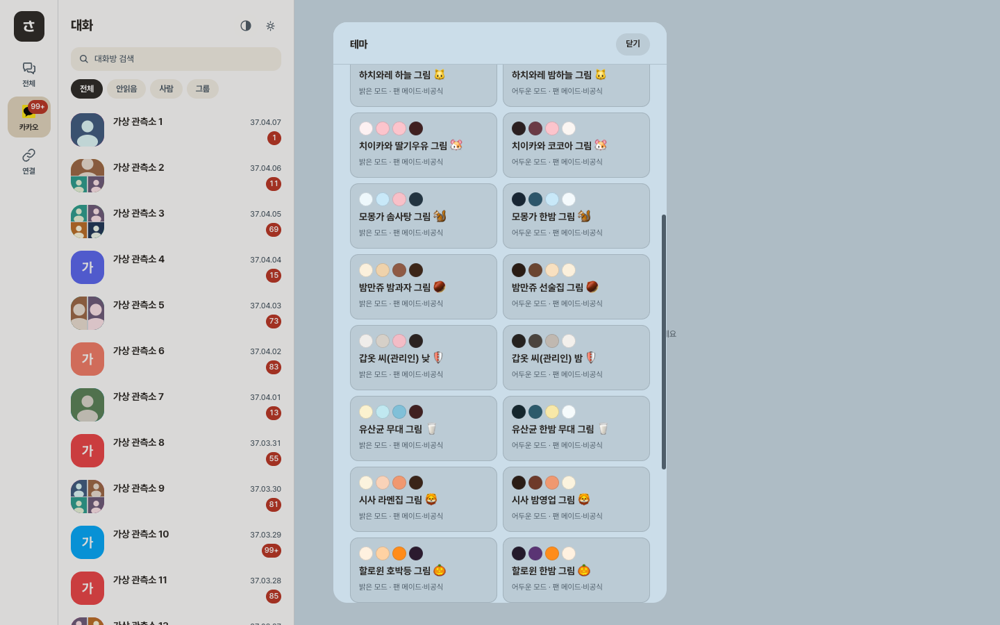

[English](README.md) · **简体中文** · [日本語](README.ja.md) · [한국어](README.ko.md)

# saya-themes

聊天网页客户端 [saya](https://github.com/sanguneo/saya) 的现成主题。每个主题是一个 JSON 文件，saya 用检查粘贴主题时的同一套规则来检查它。

> **粉丝自制、非官方、非商业。** 这些主题与原作者及官方权利人无关。「ちいかわ」 © nagano / chiikawa committee。`-img` 主题中的图片归其权利人所有，详见[声明](#声明)。



## 主题

每个角色在 `themes/<id>/` 下有四个文件：浅色和深色，各有纯色版和带图版（`-img`：聊天壁纸、房间列表花纹、吉祥物、徽章、加载图）。应用内的合集显示两个带图版。

| 角色 | 文件夹 | 浅色 | 深色 |
| --- | --- | --- | --- |
| 乌萨奇（Usagi） | [`themes/usagi`](themes/usagi) | [预览](previews/usagi-light.png) | [预览](previews/usagi-dark.png) |
| 小八（Hachiware） | [`themes/hachiware`](themes/hachiware) | [预览](previews/hachiware-light.png) | [预览](previews/hachiware-dark.png) |
| 吉伊（Chiikawa） | [`themes/chiikawa`](themes/chiikawa) | [预览](previews/chiikawa-light.png) | [预览](previews/chiikawa-dark.png) |
| 小桃（Momonga） | [`themes/momonga`](themes/momonga) | [预览](previews/momonga-light.png) | [预览](previews/momonga-dark.png) |
| 栗子馒头（Kurimanju） | [`themes/kurimanju`](themes/kurimanju) | [预览](previews/kurimanju-light.png) | [预览](previews/kurimanju-dark.png) |
| 铠甲人（Yoroi-san，管理员） | [`themes/yoroi`](themes/yoroi) | [预览](previews/yoroi-light.png) | [预览](previews/yoroi-dark.png) |
| 乳酸菌侠（Muchauman） | [`themes/yusangyun`](themes/yusangyun) | [预览](previews/yusangyun-light.png) | [预览](previews/yusangyun-dark.png) |
| 风狮（Shisa，拉面店店员） | [`themes/shisa`](themes/shisa) | [预览](previews/shisa-light.png) | [预览](previews/shisa-dark.png) |
| 万圣节（2026年10月1日至11月7日，KST） | [`themes/halloween`](themes/halloween) | [预览](previews/halloween-light.png) | [预览](previews/halloween-dark.png) |

预览中的房间和消息都是虚构的。

季节限定条目可在 `gallery.json` 的角色对象中选填 `from` 和 `until`。格式为 `yyyy-MM-dd`，按韩国标准时间（KST）计算，包含起止两天。省略的一端不设期限，两项都省略则全年显示。支持季节筛选的应用会隐藏期限外或日期格式错误的条目。CI 也会拒绝不存在的日期和倒序期限。

## 在 saya 中选择主题

点开主题按钮（房间列表顶部的半圆图标），滚动到 **主题合集**（테마 모음）。点一张卡片，就会下载该主题，与你自己的主题保存在一起并立即应用。再点一次会覆盖已保存的那份。下载失败时什么都不会改变，界面会提示你重试。

saya 默认从 `https://heoooooon.github.io/saya-themes/gallery.json` 读取列表。部署方可以在构建时用 `VITE_THEME_GALLERY_URL` 指向别处，并且其 Content-Security-Policy 的 `connect-src` 必须允许该来源。

## 手动粘贴主题

1. 打开 `themes/` 下的文件，查看原始内容（raw）并全部复制。
2. 在 saya 中：主题按钮 → **制作主题**（테마 만들기）→ 粘贴到 **粘贴主题**（테마 붙여넣기）→ **确认**（확인）。
3. 查看预览，点击 **保存并应用**（저장하고 적용）。

不支持图片的 saya 会忽略 `images`，只应用颜色。

## 添加主题

1. 在 `themes/<id>/` 中放入四个文件：`<id>-light.json`、`<id>-dark.json`（纯色）、`<id>-light-img.json`、`<id>-dark-img.json`（带图）。格式是 saya 的主题 JSON（saya 的 `docs/THEMES.md`）。
2. 在 [`gallery.json`](gallery.json) 中为角色添加一行。`name`、`mode`、`colors` 从带图文件中照抄（`colors` 依次为 `tokens.wall`、`tokens.bubbleSelf`、`tokens.accent`、`tokens.text`）。`path` 是相对于本仓库的路径：

   ```json
   { "id": "<id>", "name": "<角色>", "themes": [{ "mode": "light", "name": "<名称>", "colors": ["<wall>", "<bubbleSelf>", "<accent>", "<text>"], "path": "themes/<id>/<id>-light-img.json" }, { "mode": "dark", "...": "..." }] }
   ```

3. 在 [SOURCES.md](SOURCES.md) 中补上角色和出处。
4. 运行 `bun install` 和 `bun scripts/validate.ts`，然后提交 Pull Request。CI 会运行同样的检查。

检查会拒绝：saya 会拒绝的主题、任何对比度警告、saya 会忽略的字段、名称/模式/颜色与文件不一致的合集条目、不存在的文件，以及没有合集条目指向的带图文件。规则是 saya 规则的原样副本（`vendor/saya`，来源提交见 [vendor/saya/SOURCE.md](vendor/saya/SOURCE.md)）。

请只添加可以免费、非商业分享的图片，并注明出处。

## 声明

- 这些主题是粉丝自制、非官方、非商业的，与原作者或权利人没有任何关联，也未获其认可或赞助。
- 「ちいかわ」 © nagano / chiikawa committee。`-img` 主题中的所有图片归其权利人所有。
- 出处：LINE STORE 官方贴图预览（贴图包 [25264193](https://store.line.me/stickershop/product/25264193/ja)、[29118925](https://store.line.me/stickershop/product/29118925/ja)、[32411274](https://store.line.me/stickershop/product/32411274/ja)、[32367501](https://store.line.me/stickershop/product/32367501/ja)、[32855985](https://store.line.me/stickershop/product/32855985/ja)、[32855981](https://store.line.me/stickershop/product/32855981/ja)、[33799640](https://store.line.me/stickershop/product/33799640/ja)），官方商店 [chiikawamarket.jp](https://chiikawamarket.jp) 的商品图片，以及 TV 动画第 138 话和第 175 话的画面。逐个文件的出处见 [SOURCES.md](SOURCES.md)。
- **删除请求：** 如果你是相关权利人并希望删除，请在本仓库提交 issue。我们会立即删除，不作争辩。

## 许可

代码、规则副本和 JSON 结构采用 [MIT 许可证](LICENSE)。图片不在此列：图片归其权利人所有，本仓库不授予任何许可。
